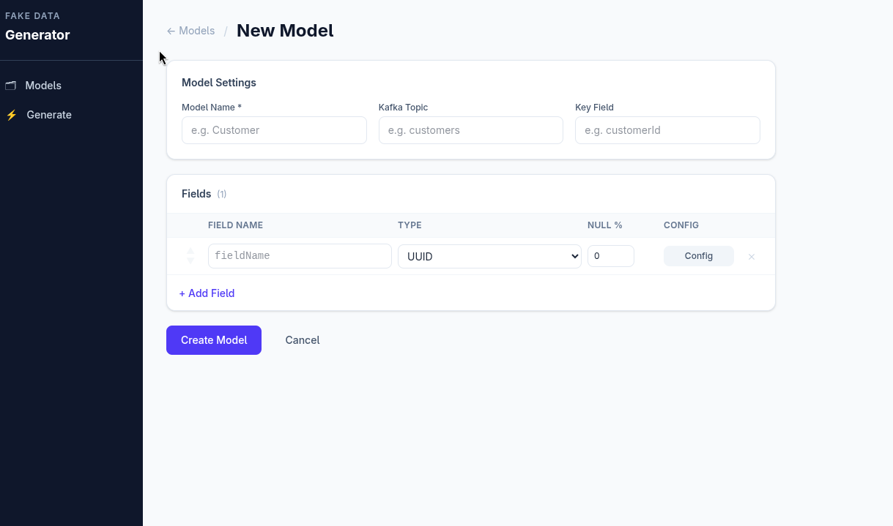
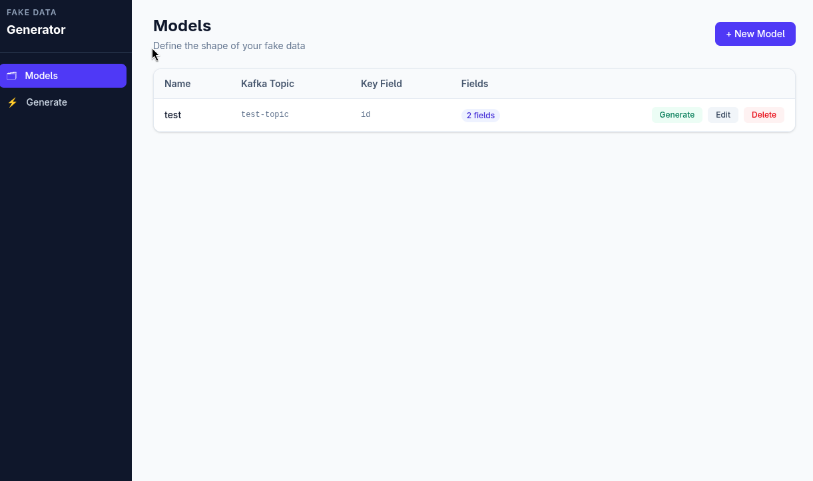
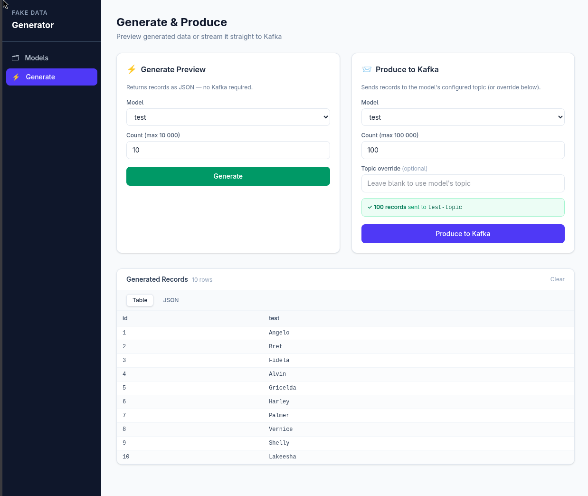

# Fake data generator for Apache Kafka

## Components
- Kafka server - Bootstraper server container which receives the data sent from the backend
- Backend Spring Boot Application - ( Java, Spring Boot)
- React Front end for creating models and trigger sending data to Kafka


## Installing
### **Recomended Method - Docker compose**
#### Requirements - Docker, Docker Compose, Java 24, Node 24.13+, npm 11.10+
```
git clone git@github.com:shalvin-shaji/fake-data-generator.git
cd fake-data-generator
docker compose up -d 
```
Docker compose will create a shared network for the components and exposes the fronend to the localhost:3000

### Project Preview
- Create Model Page


- Models Page


- Generate Page

